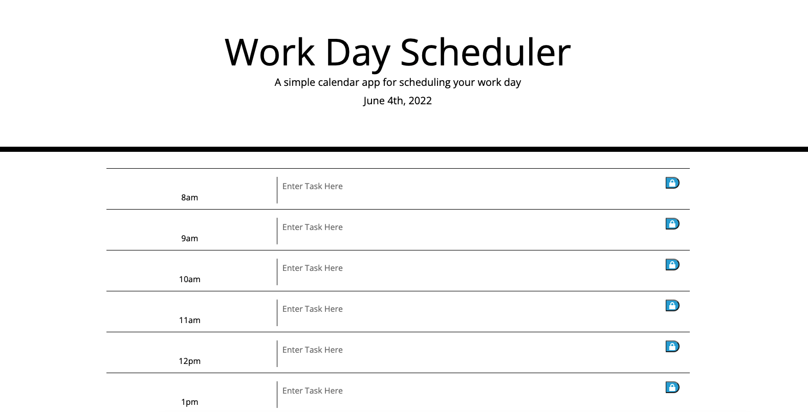

# Challenge Five: Work Day Scheduler

## For this challenge, I attempted to create a work day scheduler. The scheduler does show the current date at the top and allows you to input tasks and save to local storage. It doesn't, however, have color-coded blocks to indicate if a time block is in the past, present, or future. It also doesn't allows the events to persist. 

### This link will take you to the deployed application:

[See deployed site here](https://kristynerhaugen.github.io/summer-scheduler/)

## Installation
### Access the code via GitHub. Install how you would usually install from a GitHub repository. 

## Usage
### This application is to be used to take a four question quiz. 

### These images show the deployed site:
#### 

## Credits 
### I used what I learned in the BootCamp Spot modules and BootCamp classes to create this scheduler. My tutor, Rebecca Burke, helped me by talking about inner HTML and localStorage. Our class TA, Alex G., also worked with me to get each hour block to save into localStorage. Along with using information from BootCamp modules, I also consulted the following websites. https://developer.mozilla.org/en-US/docs/Web/API/Window/localStorage and https://www.w3schools.com/html/html5_webstorage.asp helped me to better understand localStorage. https://getbootstrap.com/docs/4.3/layout/overview/ to better understand using Bootstrap shortcuts for layout. https://momentjs.com/ helped me to use momentjs to get the current date to display 

## License